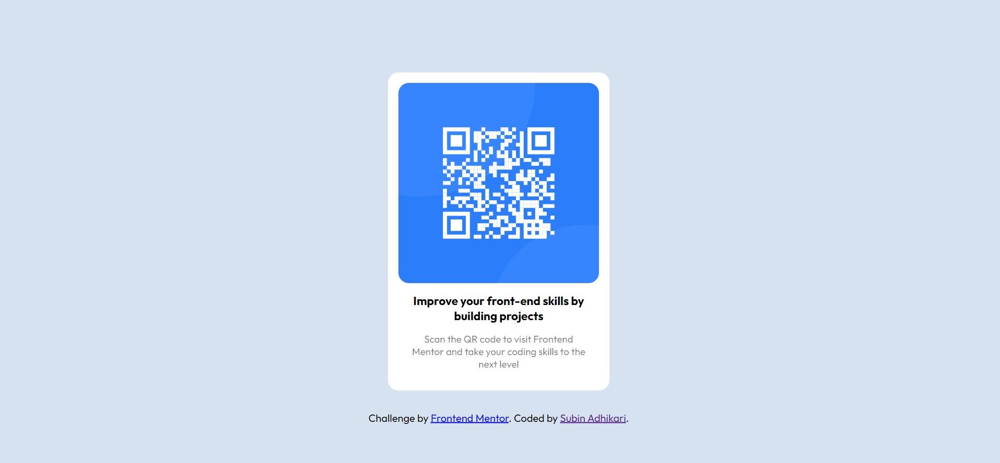
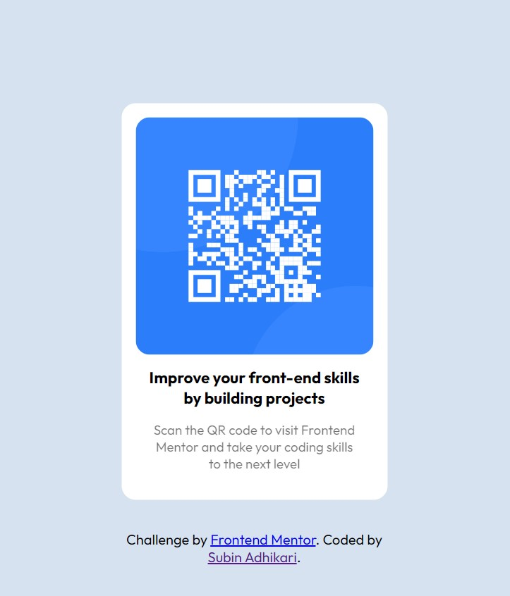

# Frontend Mentor - QR code component solution

This is a solution to the [QR code component challenge on Frontend Mentor](https://www.frontendmentor.io/challenges/qr-code-component-iux_sIO_H). Frontend Mentor challenges help you improve your coding skills by building realistic projects.

## Table of contents

- [Screenshot](#screenshot)
- [Links](#links)
- [My process](#my-process)
  - [Built with](#built-with)
  - [Useful resources](#useful-resources)
- [Author](#author)

### Screenshot

### Links

- Solution URL: [qr-challange.netlify.app]
- Live Site URL: [qr-challange.netlify.app]

### Built with

- Semantic HTML5 markup
- CSS Grid
- Mobile-first workflow

**Note: These are just examples. Delete this note and replace the list above with your own choices**

### Useful resources

- [w3school](https://www.w3schools.com/howto/howto_css_center-vertical.asp) - This helped me for centering vertically and horizentally. I really liked this pattern and will use it going forward.

## Author

- Website - [Subin Adhikari](https://www.subin.name.np)
- Frontend Mentor - [@Asfen](https://www.frontendmentor.io/profile/Asfen)

## Acknowledgments

Thank to all the online resources. Specially w3school (https://www.w3schools.com/howto/howto_css_center-vertical.asp). Used this code to center the section vertically and horizentally.
I was stock for a good while before it found it. :)
